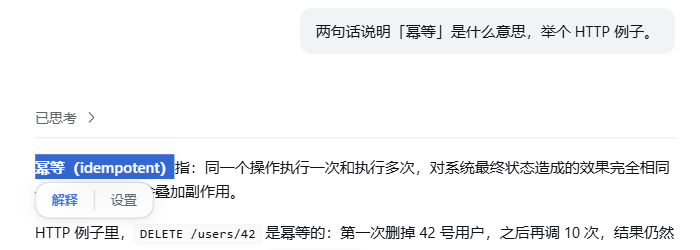
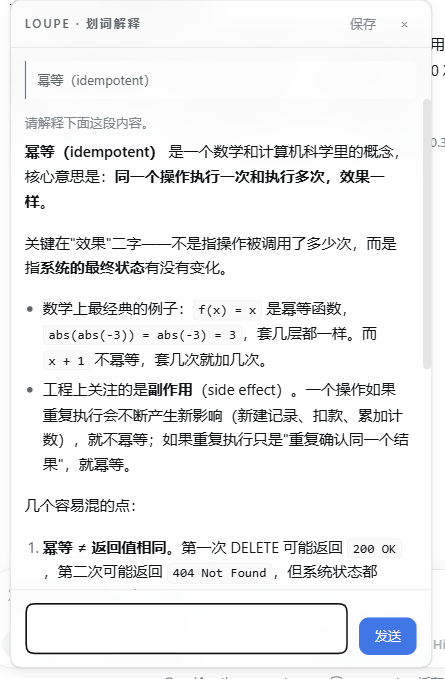

<div align="center">


# dsh-loupe

**轻量DSH划词（句）解释插件**

简体中文 | [English](README.en.md)

选中 DSH 对话里的一个词或一句话，浮窗里把它讲明白。快速，轻量，无额外会话污染。

>若需**重度长上下文追问**，推荐使用我的另一款插件
[**dsh-tree-view**](https://github.com/Rice00/dsh-tree-view)进行树分支询问。

[](https://www.npmjs.com/package/dsh-loupe)
[](./LICENSE)
[](#安装)
[](#常见问题)
[](#参与贡献)
[](https://github.com/Rice00/dsh-loupe/stargazers)

</div>

---

选中一个词，将显示面板：



点「解释」，浮窗直接开问：



## 功能

| | |
|---|---|
| 🖱️ **划词即弹** | 选中正文里任意文字，选区下方浮出「解释 / 设置」两个入口。 |
| 🪟 **浮窗回答** | 不是侧栏。单实例、可多轮追问、流式 markdown、能拖走、位置记住。 |
| 🔌 **不建会话** | 只发一次模型请求：不写会话日志、不注册工具，左侧列表不会变脏。 |
| 📚 **自带上下文** | 用插件自己的 `context.md`，不拖 agent 的全量上下文 —— 更快也更省。 |
| 🔁 **自动累积** | 每次解释后沉淀「选了什么 → 得出什么」，同一个词越问越准。 |
| 🗂️ **全量留档** | 每次问答都进历史，可按关键词搜索、分页翻；点一条就复原回浮窗接着问。 |
| 📌 **可存成正式会话** | 值得留下的解释，选个目标工作区一存，就成了左侧列表里的真会话，并自动命名为「划词 · <词>」。 |
| 🌐 **中英双语** | 界面与提示词中英双语，`auto` 跟随宿主界面语言、其次浏览器语言，也可以手动锁定。 |
| 🧠 **推理可折叠** | 模型自己的推理过程默认收起，想看再展开；从历史复原时它还在。 |
| 🌗 **跟随主题** | 深浅主题与皮肤跟随宿主；宿主没提供设计令牌时按系统深浅兜底。 |
| 🔑 **零配置** | 借用宿主的 llm 服务，不用填 API key。 |
| 🫧 **玻璃质感** | 半透明 + 背景模糊，可在参数页关掉。 |

## 插件特点

**快。** 点「解释」的时候它已经在问了 —— 浮窗打开即提交，不用再按一次发送。推理档默认 `off`，实测三次首字 **503ms / 544ms / 634ms**，整段答案 1.7–2.5 秒。它也不把 agent 的全量上下文拖进来，只发你选的那句加一本小本子；小本子放在 prompt 的固定位置，还能吃到宿主的 prompt 缓存。

**准。** 发给模型的只有三样：你选中的文字、它所在的那条消息（默认只带这一条）、以及 `context.md`（上限 2200 字）。不掺主会话那几十万 token，也就没有无关内容把解释带偏。`context.md` 里可以写术语表和你自己的用法偏好；自动累积还会把「选了什么 → 得出什么」沉淀回去，同一个词问到第二遍，比第一遍更贴你的语境。

**轻。** 宿主半端只 import `node:fs` / `node:os` / `node:path` / `node:crypto`，零第三方依赖；界面半端是手写的模块加载器模块，没有构建产物要同步。它不建会话、不写会话日志、不注册工具 —— 跑完只留下两个文件：`context.md` 和 `history.jsonl`。

**只做一件事。** 它不聊天、不总结、不改代码，就是把选中的这段解释清楚。一次问答，读完关掉；真要展开成长期讨论，点「保存」把它交回主会话。

## 安装

### 本地目录（推荐）

```bash
git clone https://github.com/Rice00/dsh-loupe.git
dsh plugin --profile <profile> add link:/abs/path/to/dsh-loupe
```

补丁会往 profile 里插一行（`loupe`）。**然后重启这个 profile** —— 宿主插件模块在进程内缓存，运行中的 harness 读不到新行。只改界面的话刷新浏览器就够了。

`link:` 是活链接，改源码立刻生效；代价是装完之后不能挪动这个目录。想连文件一起复制走用 `file:`，以后每次改都要重装。

### 从 npm 或 GitHub

```bash
dsh plugin --profile <profile> add dsh-loupe                    # npm
dsh plugin --profile <profile> add github:Rice00/dsh-loupe      # GitHub
```

### 让 AI 助手帮你装

```
请帮我安装 DSH 插件 dsh-loupe：

1) 装进 web profile，三种来源任选：
     从 npm：
       dsh plugin --profile web add dsh-loupe
     从 GitHub：
       dsh plugin --profile web add github:Rice00/dsh-loupe
     或从本地检出（填这个文件夹的绝对路径）：
       dsh plugin --profile web add link:<绝对路径>
2) 重启该 profile —— 宿主插件模块在进程内缓存，新行只在启动时读。
   （只改界面的话，刷新浏览器就够了。）
3) 验证：随便打开一个会话，在正文里选中一句话。
   选区下方应浮出「解释 / 设置」；点「解释」应弹出浮窗并流式作答，
   浮窗底部应有一行统计（N 字 · 首字 …ms · 共 …ms）。
4) 不灵就看设置页第四栏「诊断」：它把宿主 llm 服务、模型解析、
   context.md 可写性、拖动事件计数、工作区探测结论逐项列出来。
```

## 常见问题

**会污染我的主会话吗？**
不会。只发一次模型请求，不建会话、不写会话日志、不注册工具。

**要填 API key 吗？**
不用。走宿主已有的 `llm` 服务，默认跟随 `agent-default-model`。

**它和「侧边对话」有什么不同？**
侧边对话会把主会话的整个历史 fork 一份，几十万 token；这个插件只带上你选的那句话和一本小本子。

**为什么默认 `off` 推理档？**
解释单段文字用不上高推理。同一个问题实测 off 首字 **544ms**，low **2806ms**。嫌答得浅就在参数页调 `low`。

**关掉浮窗，内容还在吗？**
在。全在 `history.jsonl` 里，设置页「历史」点一条就能接着问。

**浮窗拖不动？**
设置页「诊断」里有拖动事件计数 —— 拖一下看数字涨不涨，就知道事件有没有传到宿主。

**玻璃质感没效果？**
需要浏览器支持 `color-mix`。不支持时自动退回实底，其余功能照常。

**界面能换英文吗？**
能。设置页「参数」里的「界面语言」选 `en`，界面与提示词立刻变英文；`auto` 跟随宿主界面语言，宿主没声明时用浏览器语言。主题不用选，它自己跟随宿主。

## 参数

设置页「参数」里改，下一次解释就生效。

| 参数 | 默认 | 说明 |
|---|---|---|
| 推理档 | `off` | `off` / `low` / `high` / `max`。解释单段文字用不上高推理。 |
| 邻域条数 | `0` | `0` / `1` / `2` / `4`。选区前后各带几条对话进 prompt。0 = 只带所在那条消息。 |
| 玻璃质感 | `on` | `on` / `off`。半透明 + 背景模糊；关掉是实底，拖动更跟手。 |
| 自动累积 | `on` | `on` / `off`。把每次结论沉淀进 `context.md`。 |
| 上下文上限 | `2200` | `800` / `2200` / `4000` / `8000` 字符。`context.md` 注入的长度上限。 |
| 界面语言 | `auto` | `auto` / `zh` / `en`。`auto` 先跟随宿主界面语言，再退到浏览器语言；只翻译界面与提示词。 |

## 数据与接口

<details>
<summary>给要改代码或接管线的人</summary>

数据落在 `~/.dsh/loupe/`（有 `DSH_HOME` 就跟着它）：

```
context.md     插件上下文（手写的部分 + 自动累积的带标记区块）
history.jsonl  全部问答记录（只追加，不重写；超过 8MB 时只读尾部）
```

宿主半端提供的路由：

```
GET  /plugins/dsh-loupe/probe     诊断：宿主能力 / 模型解析 / context 可写性 / 拖动事件 / 工作区探测
POST /plugins/dsh-loupe/explain   解释调用（SSE：meta / thinking / reasoning / first / delta / done / error）
GET  /plugins/dsh-loupe/history   历史（最新在前；?limit= &offset= &q= 搜索与分页）
GET  /plugins/dsh-loupe/context   读上下文
POST /plugins/dsh-loupe/context   写上下文（64 KB 上限）
POST /plugins/dsh-loupe/pin       保存成正式会话（客户端会话服务不可用时的兜底）
```

代码结构：

```
lib/index.js       宿主半端 —— 路由 / prompt 组装 / 流式解析 / 落盘（只 import Node 内置模块）
lib/client.js      界面半端 —— 划词 / 浮标 / 浮窗 / 四个页签（手写模块，无构建步骤）
cordis.patch.yml   补丁
docs/              实施与修复记录，含「保存」链路的复盘
```

宿主半端不热重载（改 `lib/index.js` 要重启 profile），界面半端刷新页面即可。

</details>

## 卸载

```bash
dsh plugin --profile <profile> remove dsh-loupe
```

`~/.dsh/loupe/` 不会跟着删。想彻底清干净就手动删掉它。

## 后续计划

- [x] 划词浮标（解释 / 设置）
- [x] 浮窗：多轮追问、流式 markdown、可拖拽、位置记忆
- [x] 独立通道：不建会话、不写会话日志
- [x] 自带上下文 + 自动累积
- [x] 历史留档与一键复原
- [x] 保存成正式会话（自己选工作区）
- [x] 玻璃质感开关
- [x] 保存后的会话自动命名
- [x] 历史检索与分页
- [x] 推理过程可折叠
- [x] 发布到 npm
- [x] English README

## 参与贡献

Issue 和 PR 都欢迎。

## 许可证

[MIT](./LICENSE)

<div align="center">
<sub>loupe = 钟表匠的寸镜，用来看清一处细节。</sub>

MIT License © dsh-loupe contributors
</div>
